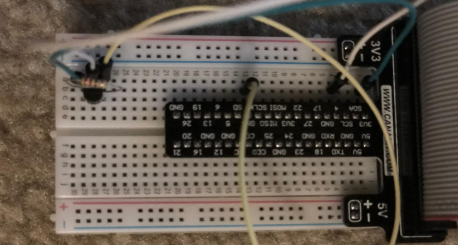
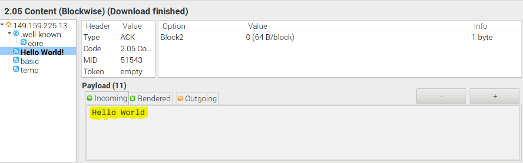
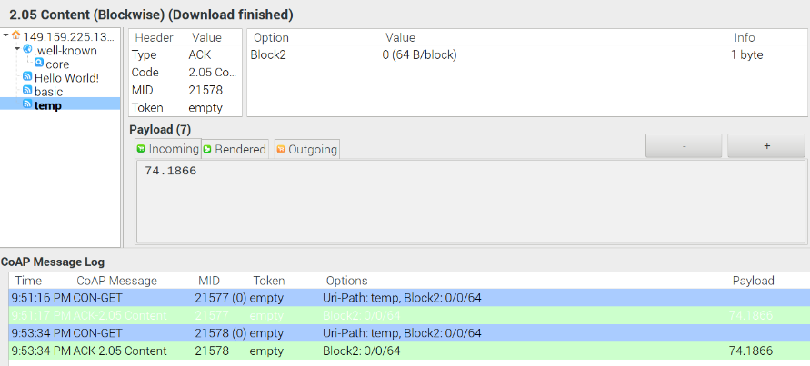

# IOT temperature sensor application 
How to connect a smart device to the Internet in a simple IoT application and thereby, 
learn the principles of CoAP(Constrained Application Protocol). Implemented one sensor, that is, the ‘ds18b20’ temperature sensor
by connecting it to the internet and making it respond to the client’s GET request. 

# Goal
 To develop a simple server on a smart device for any Internet client to query the sensor readings obtained on the smart device
 through the CoAP protocol. Used CoAP library to configure the environment for message ACK.
 In order to make the temperature sensor send the information, I had to hook up the temperature sensor to the Raspberry Pi and add provide sensor readings 
 once a request was received from an internet client. 
 
 # circuit
 
 
# Analysis and Results
On receiving the GET request, the IoT device sends the readings of our temperature sensor as an acknowledgement to the request.

The same thing is done for the temperature sensor. The temperature sensor resource is set as “temp” in the resource section.
The incoming is the temperature in degrees Fahrenheit which is set as the payload value too. 
 

